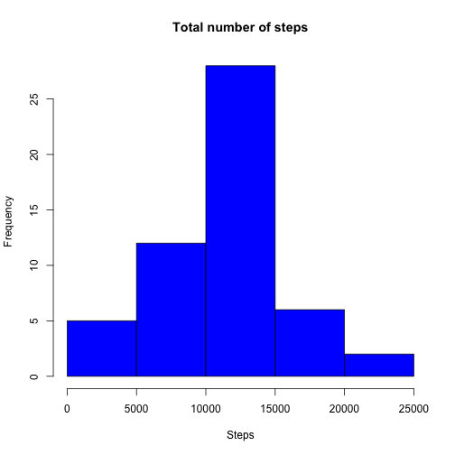
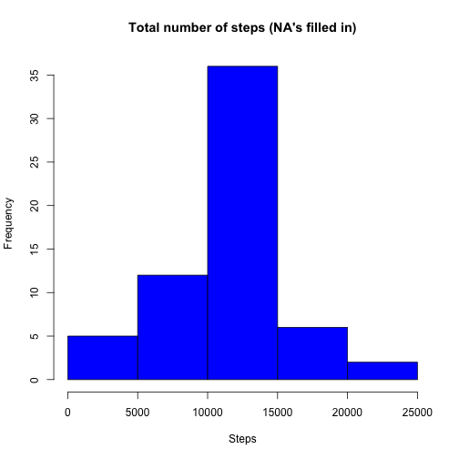
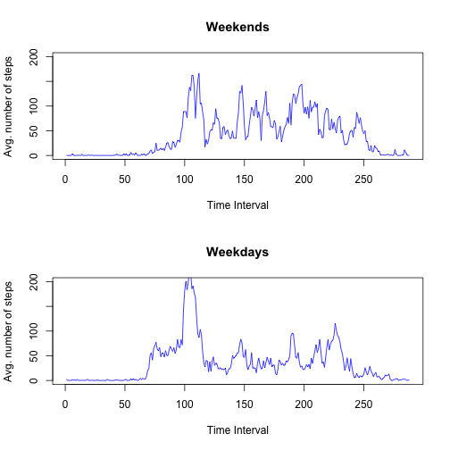

## Preliminaries
This R Markdown document solves [Peer Assignment 1](https://class.coursera.org/repdata-013/human_grading/view/courses/973514/assessments/3/submissions) of the course [Reproducible Research](https://class.coursera.org/repdata-013). In order to process, it is necessary that the **unpacked file "activity.csv"** is in your **working directory**. 

## Description
It is now possible to collect a large amount of data about personal movement using activity monitoring devices such as a [Fitbit](http://www.fitbit.com), [Nike Fuelband](http://www.nike.com/us/en_us/c/nikeplus-fuel) or [Jawbone Up](https://jawbone.com/up). These type of devices are part of the “quantified self” movement – a group of enthusiasts who take measurements about themselves regularly to improve their health, to find patterns in their behavior, or because they are tech geeks. But these data remain under-utilized both because the raw data are hard to obtain and there is a lack of statistical methods and software for processing and interpreting the data.

This assignment makes use of data from a personal activity monitoring device. This device collects data at 5 minute intervals through out the day. The data consists of two months of data from an anonymous individual collected during the months of October and November, 2012 and include the number of steps taken in 5 minute intervals each day.

### Loading and Processing
First of all, 

```r
data <- read.csv("activity.csv", sep=",", stringsAsFactors = FALSE)
```
imports the data into the current working directory (which has to contain **"activity.csv"**). The loaded data begins with

```
##   steps       date interval
## 1    NA 2012-10-01        0
## 2    NA 2012-10-01        5
## 3    NA 2012-10-01       10
## 4    NA 2012-10-01       15
## 5    NA 2012-10-01       20
## 6    NA 2012-10-01       25
```
and ends up with

```
##       steps       date interval
## 17563    NA 2012-11-30     2330
## 17564    NA 2012-11-30     2335
## 17565    NA 2012-11-30     2340
## 17566    NA 2012-11-30     2345
## 17567    NA 2012-11-30     2350
## 17568    NA 2012-11-30     2355
```
indicating that the recorded data spans two months.

### Total number of steps per day

```r
cleanData <- data[!is.na(data$steps),]
```
contains all time intervals where the number of steps is available. The total number of steps is given by 

```r
T <- tapply(cleanData$steps, cleanData$date, FUN=sum)
```
or, simply,

```r
hist(T, main = "Total number of steps", col = "blue", xlab = "Steps")
```

 

The mean and median of the total number of steps are

```r
mean(T)
```

```
## [1] 10766.19
```
and, respectively, 

```r
median(T)
```

```
## [1] 10765
```
Additional information can be taken from 

```r
summary(T, digits = 6)
```

```
##    Min. 1st Qu.  Median    Mean 3rd Qu.    Max. 
##    41.0  8841.0 10765.0 10766.2 13294.0 21194.0
```

### Average daily activity pattern

```r
I <- tapply(cleanData$steps, cleanData$interval, FUN=mean)
```
contains the average number of steps taken in each 5-minute time interval of the day. In graphics,


```r
plot(I, type = 'l', main = 'Average daily activity pattern', ylab = 'Avg. number of steps', xlab = 'Time Interval')
```

 

The 5-minute interval which, on average across all the days in the dataset, contains the maximum number of steps, is given by

```r
I[which.max(I)]
```

```
##      835 
## 206.1698
```
### On missing values
Note that there are a number of days/intervals where there are missing values (coded as NA). The presence of missing days may introduce bias into some calculations or summaries of the data. The number of missing values is given by 

```r
sum(is.na(data$steps))
```

```
## [1] 2304
```
However, in order to fill these values, we process the data by simply copying and inserting the mean of the corresponding time interval which was computed before into the copied version:

```r
filledData <- data
filledData$steps[is.na(data$steps)] <- as.numeric(I[strsplit(toString(data$interval[is.na(data$steps)]), ", ")[[1]]])
```

Equivalently to the computation above, we calculate

```r
T <- tapply(filledData$steps, filledData$date, FUN=sum)
```
or, simply,

```r
hist(T, main = "Total number of steps (NA's filled in)", col = "blue", xlab = "Steps")
```

 

The mean and median of the total number of steps are

```r
mean(T)
```

```
## [1] 10766.19
```
and, respectively, 

```r
median(T)
```

```
## [1] 10766.19
```
Additional information can be taken from 

```r
summary(T, digits = 6)
```

```
##    Min. 1st Qu.  Median    Mean 3rd Qu.    Max. 
##    41.0  9819.0 10766.2 10766.2 12811.0 21194.0
```

### Differences in activity patterns between weekdays and weekends
In order to divide between acitivity on weekdays and on weekends, first introduce a new variable *weekend* by

```r
Sys.setlocale("LC_TIME", "en_US.UTF-8")
```

```
## [1] "en_US.UTF-8"
```

```r
filledData$daytype <- ifelse(weekdays(as.Date(filledData$date), TRUE) %in% c("Sat","Sun"), "weekend", "weekday")
```
causing *filledData* to look like this:

```
##       steps       date interval daytype
## 1 1.7169811 2012-10-01        0 weekday
## 2 0.3396226 2012-10-01        5 weekday
## 3 0.1320755 2012-10-01       10 weekday
```
Splitting up the data in two groups - one for weekdays and one for days on weekends - via

```r
weekDays <- filledData[filledData$daytype == "weekday",]
weekEnds <- filledData[filledData$daytype == "weekend",]
```
gives

```r
head(weekDays,3)
```

```
##       steps       date interval daytype
## 1 1.7169811 2012-10-01        0 weekday
## 2 0.3396226 2012-10-01        5 weekday
## 3 0.1320755 2012-10-01       10 weekday
```
and

```r
head(weekEnds,3)
```

```
##      steps       date interval daytype
## 1441     0 2012-10-06        0 weekend
## 1442     0 2012-10-06        5 weekend
## 1443     0 2012-10-06       10 weekend
```
Evaluation of the average daily activity patterns indicates that on weekends the test subject is on average slightly more active than on weekdays whilst the maximum is on weekdays:

```r
par(mfrow=c(2,1))
plot(tapply(weekEnds$steps, weekEnds$interval, FUN=mean), type = 'l', main = 'Weekends', ylab = 'Avg. number of steps', xlab = 'Time Interval', col = "blue", ylim=c(0, 200))
plot(tapply(weekDays$steps, weekDays$interval, FUN=mean), type = 'l', main = 'Weekdays', ylab = 'Avg. number of steps', xlab = 'Time Interval', col = "blue", ylim=c(0, 200))
```

 

*Note: The ggplot2 package is more suitable for this type of chart. However, in combination with RStudio and some versions of MacOS it causes fatal errors on import.*
